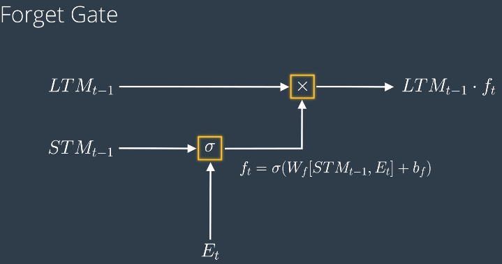
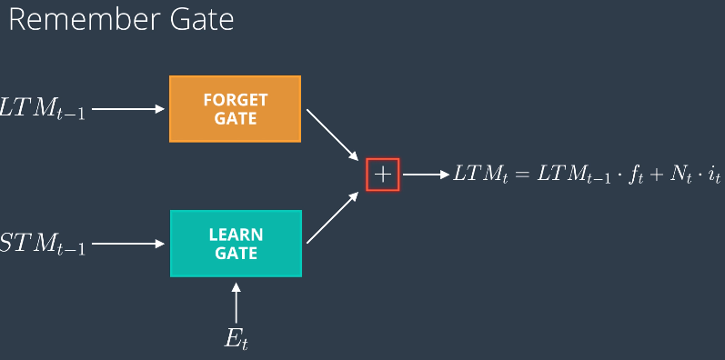

## RNN vs LSTM
#### In RNN
* The inputs are 
    1. input ('event'/new datapoint), dim (batch_size, seq_length, input_size)
    1. hidden ('old memory', customized # layers AND # dimensions), dim (n_layers, batch_size, hidden_dim)
* The outputs are
    1. output (prediction) - In pytorch, default tourch.nn.RNN, the output has dimension of (batch_size, time_step, hidden_dim), but this can be customized to the desired output dimension by adding more layers after the default RNN layer. See customized RNN with torch.nn.RNN + Linear layer <pre>..\deep_learning_v2_pytorch\recurrent-neural-networks\time-series\Simple_RNN.ipynb</pre>
    1. hidden ('new memory'), dim (n_layers, batch_size, hidden_dim)

#### In LSTM
* The inputs are 
    1. input ('event'/new datapoint)
    1. Long Term Memory ('old LTM', customized # layers and # dimensions)
    1. Short Term Memory ('old STM', previous prediction)
* The outputs are
    1. output (new prediction, also serves as new STM)
    1. Long Term Memory
    

## LSTM 
* Overall Structure  

1. Learn Gate  
  
Equation 1  
  
1. Forget Gate  
  
Equation 2  

1. Remember Gate  
  
Equation 3  

1. Use Gate  

Equation 4  
  
The output of use gate is the output of prediction as well as the new short-term memory STMt

